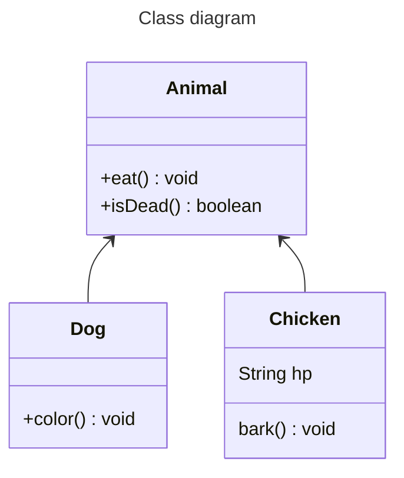

# To-do list

1. [x] collision + map interaction
1. [x] layered map
1. [x] camera
1. [x] after camera do facing left and right relative to character
1. [x] magic
1. [x] effect (slash + magic)
1. [x] sound effect manager
1. [x] sound effect
1. [x] enemy
1. [x] damage calculation
1. [x] main menu
1. [ ] เดินไถลกำแพงตอนเดินติด
1. [x] interacable
1. [ ] small map fix

## Sorcerer's Odyssey

